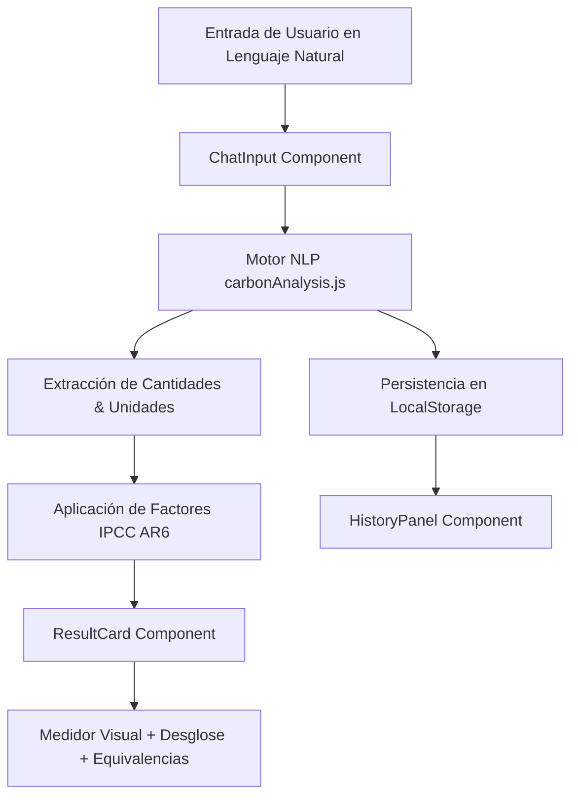
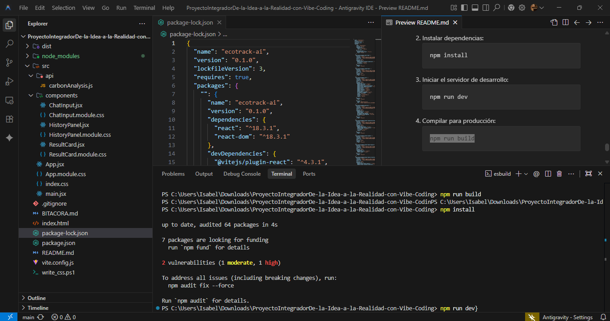
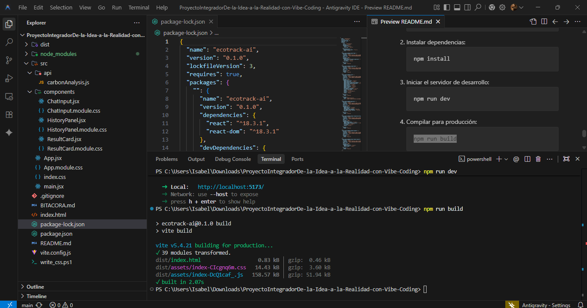
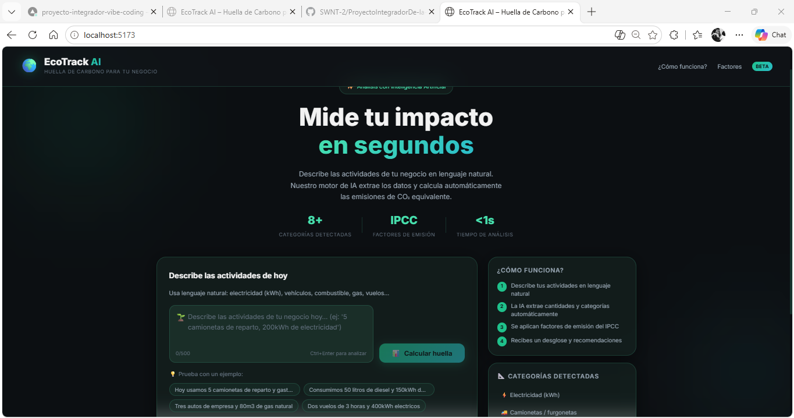
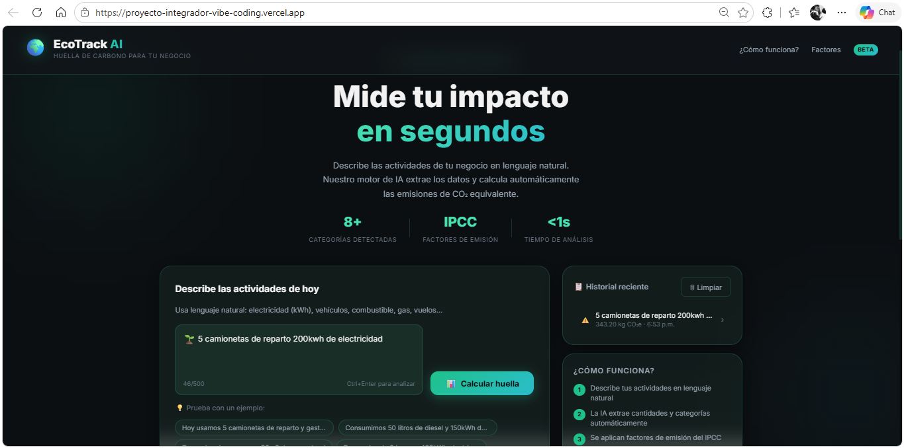
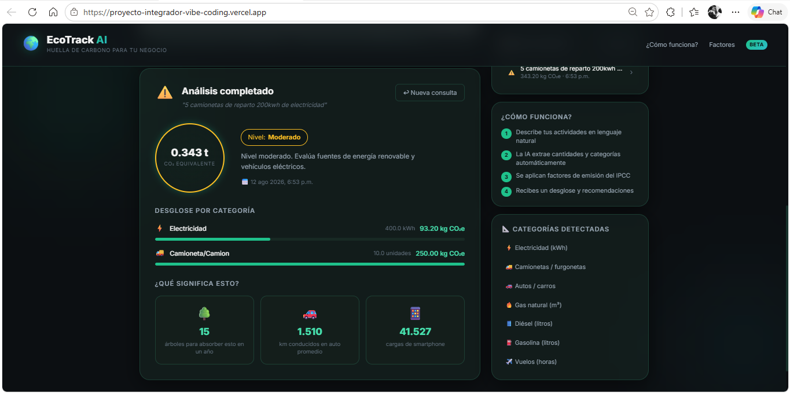

# 🌍 EcoTrack AI - Calculadora de Huella de Carbono Inteligente

> **Autor:** Tomas Felipe Ramirez Alvarez  
> **Proyecto Integrador:** De la Idea a la Realidad con Vibe Coding  
> **Metodología:** Intent-First & AI-Orchestrated Development  
> **Estado:** MVP 100% Funcional, Compilado y Desplegado en GitHub

---

## 📌 1. Entregables del Proyecto

### 🌐 Enlaces al Proyecto
- **Aplicación Desplegada en Vivo (Vercel):** [https://proyecto-integrador-vibe-coding.vercel.app](https://proyecto-integrador-vibe-coding.vercel.app)
- **Repositorio en GitHub:** [https://github.com/SWNT-2/ProyectoIntegradorDe-la-Idea-a-la-Realidad-con-Vibe-Coding](https://github.com/SWNT-2/ProyectoIntegradorDe-la-Idea-a-la-Realidad-con-Vibe-Coding)
- **Documento de Bitácora:** [BITACORA.md](file:///C:/Users/Isabel/Downloads/ProyectoIntegradorDe-la-Idea-a-la-Realidad-con-Vibe-Coding/BITACORA.md)
- **Dominio Secundario Vercel:** [https://proyecto-integrador-vibe-coding-git-main-tomaspro572.vercel.app](https://proyecto-integrador-vibe-coding-git-main-tomaspro572.vercel.app)

---

## 📄 2. Documento de Bitácora (Resumen Ejecutivo)

### 🤖 A. Funcionalidad de IA Implementada
EcoTrack AI implementa un motor de **Procesamiento de Lenguaje Natural (NLP)** determinista optimizado para evaluar texto no estructurado en español e inglés.

1. **Extracción Multivariable:** Convierte expresiones libres (*"Usamos 5 camionetas de reparto y gastamos 200kWh de luz"*) en métricas estructuradas de consumo.
2. **Parser de Números Escritos:** Identifica cantidades expresadas tanto en dígitos (`200`, `50.5`) como en palabras (`un`, `dos`, `tres`, `cinco`, `ten`).
3. **Factores de Emisión Oficiales (IPCC AR6):**
   - ⚡ Electricidad: `0.000233 tCO₂e / kWh`
   - 🚚 Camionetas/Furgones: `0.025 tCO₂e / unidad`
   - 🚗 Autos de empresa: `0.012 tCO₂e / unidad`
   - 🔥 Gas Natural: `0.00202 tCO₂e / m³`
   - 🛢️ Diésel: `0.00268 tCO₂e / litro`
   - ⛽ Gasolina: `0.00232 tCO₂e / litro`
   - ✈️ Vuelos: `0.090 tCO₂e / hora`
4. **Traducción de Impacto & Recomendaciones:** Genera equivalencias en tiempo real (árboles requeridos para absorber la emisión, kilómetros recorridos en auto y cargas de celular) e indica acciones correctivas según el nivel de emisión.

---

### 💬 B. Prompts Principales Utilizados durante el Vibe Coding

| Fase | Prompt Utilizado | Resultado Generado |
| :--- | :--- | :--- |
| **Diseño y Estética UI** | *"Diseña una interfaz web React moderna con estética Premium Dark Mode, Glassmorphism con bordes sutiles y acentos en verde azulado (Teal/Emerald). Incluye orbes flotantes animados."* | `src/index.css` y `App.module.css` con variables CSS de alto contraste y animaciones `@keyframes`. |
| **Motor de Cálculo NLP** | *"Implementa un motor de análisis en JS que extraiga cantidades e identifique categorías operativas desde un texto libre y aplique factores de emisión del IPCC AR6."* | `src/api/carbonAnalysis.js` con regex dinámica y cálculo de equivalencias. |
| **Componentes de Usuario** | *"Crea componentes modulares para entrada de chat con autosize y ejemplos rápidos, tarjeta de resultados con medidor circular y un panel de historial con localStorage."* | `ChatInput.jsx`, `ResultCard.jsx` y `HistoryPanel.jsx`. |
| **Verificación y Build** | *"Verifica la integridad del proyecto, corrige errores de tipado o imports y realiza la compilación para producción con Vite."* | `npm run build` exitoso sin errores ni advertencias en la carpeta `dist/`. |

---

### 🎨 C. Proceso de Iteración y Arquitectura



1. **Iteración 1 (Front-end Foundation):** Scaffolding de React + Vite con un diseño visual en modo oscuro y efectos de cristal (*glassmorphism*).
2. **Iteración 2 (Core Logic & NLP):** Desarrollo de la lógica de procesamiento para interpretar texto libre y convertirlo a kg/toneladas de CO₂e.
3. **Iteración 3 (UX & Persistencia):** Implementación del almacenamiento en `localStorage`, ejemplos interactivos en 1 clic y respuestas visuales inmediatas.
4. **Iteración 4 (Build & Polish):** Optimización de CSS Modules, accesibilidad (tags ARIA) y preparación del repositorio para integración continua (CI/CD) en Vercel.

---

## 🛠️ 3. Estructura del Repositorio

```text
.
├── BITACORA.md                   # Bitácora técnica completa de Vibe Coding
├── README.md                     # Documentación principal y guía del proyecto
├── index.html                    # HTML5 semántico optimizado con meta SEO
├── package.json                  # Dependencias de React 18, Vite y scripts
├── vercel.json                   # Configuración para despliegue automatizado
├── vite.config.js                # Configuración de compilación con Vite
└── src/
    ├── App.jsx                   # Componente principal / Orquestador
    ├── App.module.css            # Estilos de layout responsivo y hero
    ├── index.css                 # Sistema de diseño global y tokens CSS
    ├── main.jsx                  # Punto de entrada React
    ├── api/
    │   └── carbonAnalysis.js     # Motor NLP con factores de emisión IPCC
    └── components/
        ├── ChatInput.jsx         # Input de texto con chips de ejemplo
        ├── ChatInput.module.css
        ├── HistoryPanel.jsx      # Panel de historial persistente
        ├── HistoryPanel.module.css
        ├── ResultCard.jsx        # Tarjeta de resultados y equivalencias
        └── ResultCard.module.css
```

---
## Evidencias de Funcionamiento.
-  
-  
-  
-  

## Video de evidencia.
- 
## 🚀 4. Guía para Ejecutar Localmente

1. Clonar el repositorio:
   ```bash
   git clone https://github.com/SWNT-2/ProyectoIntegradorDe-la-Idea-a-la-Realidad-con-Vibe-Coding.git
   cd ProyectoIntegradorDe-la-Idea-a-la-Realidad-con-Vibe-Coding
   ```
2. Instalar dependencias:
   ```bash
   npm install
   ```
3. Iniciar el servidor de desarrollo:
   ```bash
   npm run dev
   ```
4. Compilar para producción:
   ```bash
   npm run build
   ```